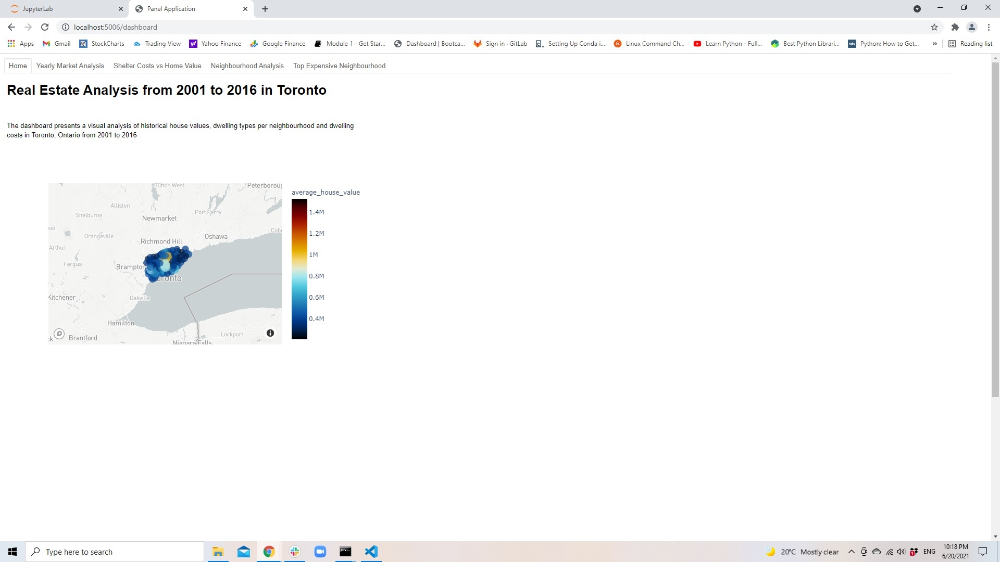
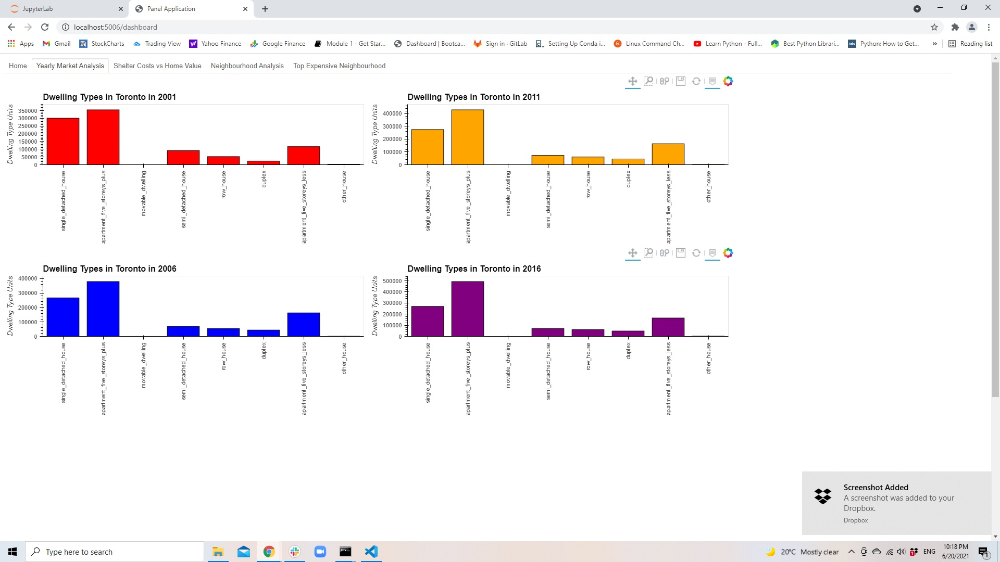
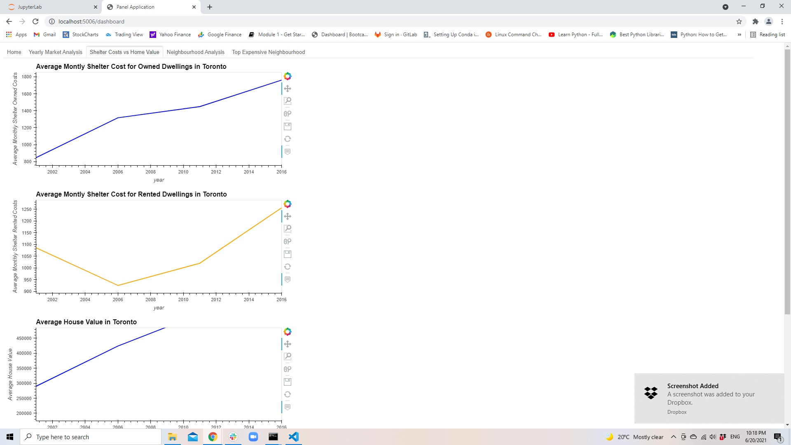
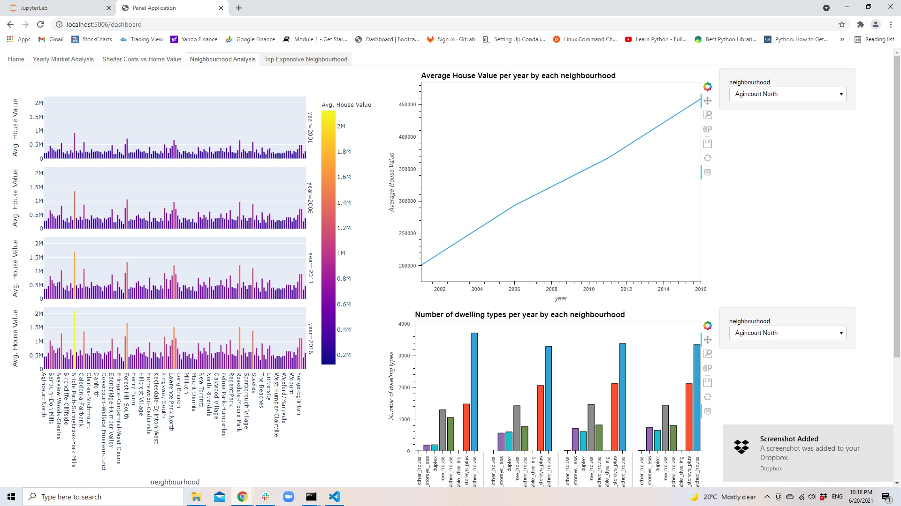
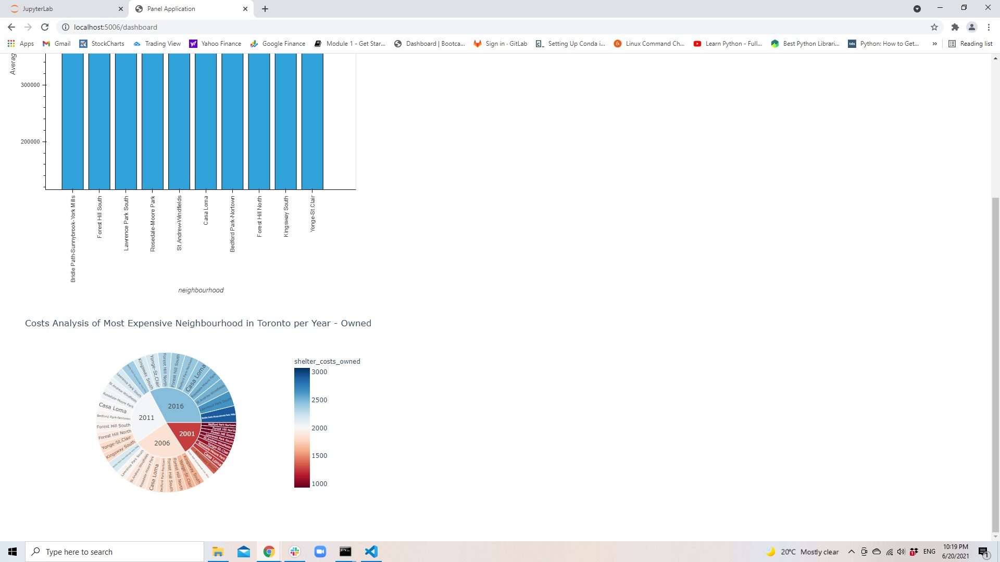

# U of T Fin Tech BootCamp Class Unit 6 Assignment #

## PyVIZ

By: Ivan Kin-Ngai Fung

Date: June 20, 2021

**Objective**

The objective of this assignment was to utilize different plot functions in PyVIZ environments, and we use different plotting packages in PyVIZ to plot different kind of graphs to interpret and to illustrate the data in a more appealing graphical representation.

Based on the given data about the property in GTA from 2001 to 2016, we were asked to use different plotting packages like line graphs, bar graphs, scatter map and sunburst plot to prepare different graphical presentation to the users.  

Furthermore, we were asked to integrate all kinds of graph from the data into a dashboard panel, so that we can a more interactive and user-friendly graphical representation to the readers and to enable them to have a better understanding of the property market in GTA.

**Dashboard Panel**

Panel was divided into 5 different tabs and each tabs will consist different graphs which were related to different spectrum of the property from 2001 to 2016.  

The five tabs included:
1) Home

2) Yearly Market Analysis

3) Shelter Costs vs Home Value

4) Neighbourhood Analysis

5) Top Expensive Neighbourhood

*Home Tab*

It consists a neighourhood map which can illustrate the average house value of the neighbourhood in the Toronto area.  The colour scheme of each dot will reveal the different average home value in different location in GTA.

*Yearly Market Analysis*

The historical data of the number of different dwelling types available in Toronto from 2001 to 2016.   We could understand the insight of the property market from the supply side from the year 2001 to 2016.  

*Shelter Cost vs Home Value*

In this section, we would study the trends of the monthly shelter costs in Toronto in relationship with the average house value from the study period.  We can observe that the living cost had been rising steady for shelter cost for the owners which was similar to the average house value from 2001 to 2016.

*Neighbourhood analysis*

With different plots from PyVIZ, we could understand different house value in different neighbourhood of GTA, and we can identify the most expensive neighbourhood in GTA during this period of time.  Furthermore, we can have a better insight of the performance of the house value in each neighbourhood.

*Top Expensive Neighbourhood*

From the neighbourhood analysis, we identified the top 10 most expensive neighbourhood in Toronto.  We had the better understanding of the average house value in these neighbourhood and the average monthly shelter cost in these elite neighbourhood during this period of time.  

